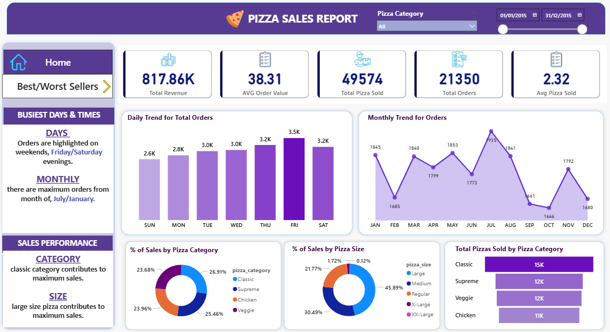
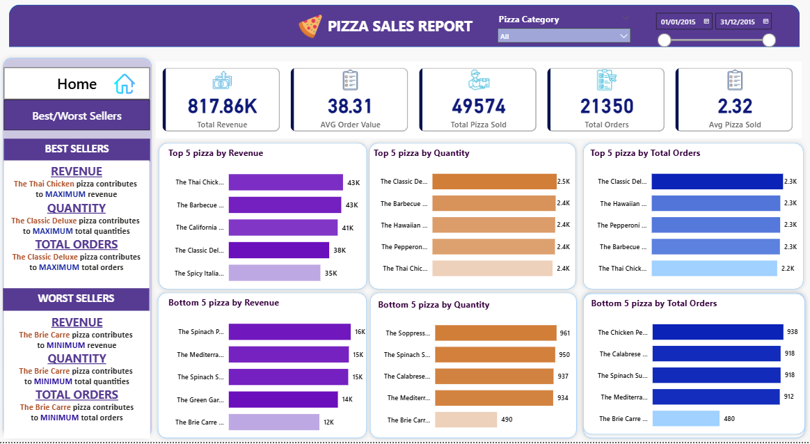

# 🍕Pizza Sales Analysis Dashboard  

  

  

## Project Overview  
This project presents an end-to-end data analysis workflow for pizza sales. It combines SQL for data extraction and KPI calculation with Power BI for building an interactive dashboard that delivers actionable business insights.

---

## 🚀 Key Features  
- KPI calculation using SQL  
- Daily & Monthly sales trend analysis  
- Sales breakdown by category & size  
- Top 5 & Bottom 5 products analysis  
- Interactive dashboard with filters & navigation  
- Business insights for decision-making  

---

## Tools & Technologies  
- **SQL** → Data querying & KPI computation  
- **Power BI** → Dashboard & visualization  
- **Power Query** → Data cleaning & transformation  

---

## 📈 Key Metrics  
- Total Revenue  
- Average Order Value  
- Total Pizzas Sold  
- Total Orders  
- verage Pizzas per Order  

---

## Dashboard Insights  
- Peak orders occur on **weekends (Friday & Saturday evenings)**  
- Highest sales observed in **July & January**  
- **Classic category** contributes the most to revenue  
- **Large size pizzas** dominate sales  

---

## Skills Demonstrated  
- SQL Data Analysis  
- Data Cleaning & Transformation  
- Data Visualization  
- Dashboard Design  
- Business Analysis  
